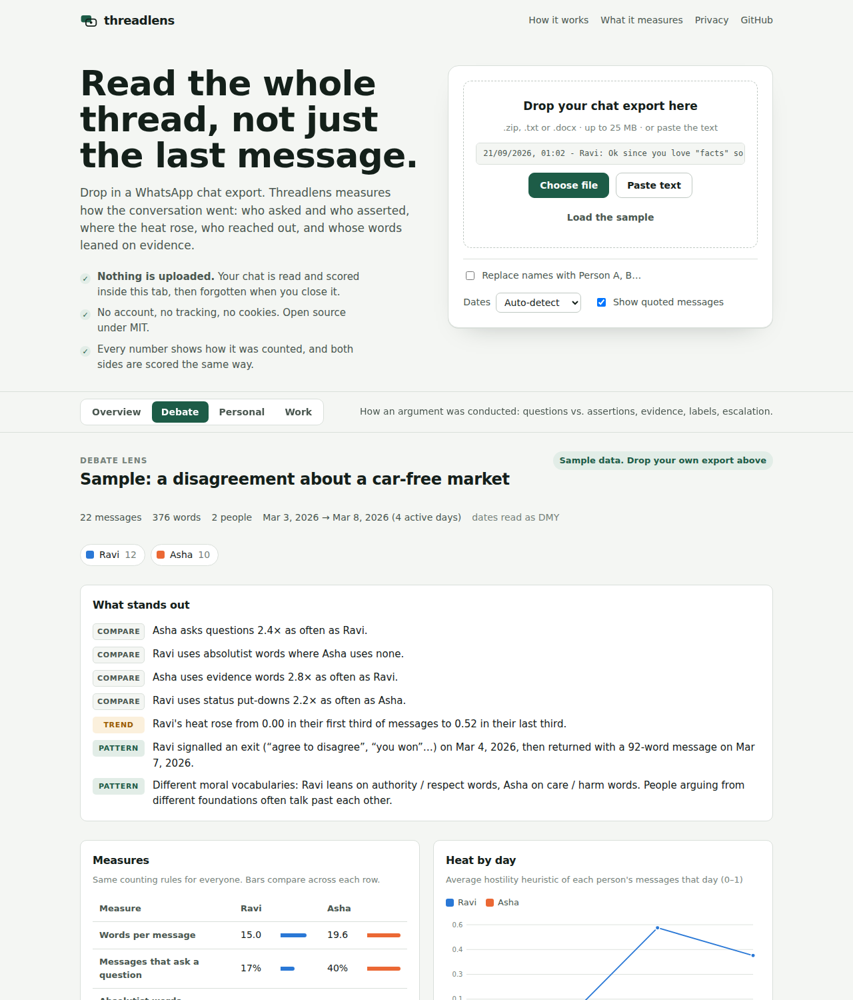

# Threadlens

**Read the whole thread, not just the last message.**

Threadlens analyses a WhatsApp chat export and shows how the conversation went. Who asked questions and who made assertions? Where did the heat rise? Who reached out, and who leaned on evidence? It runs **entirely in your browser**, so the chat is never uploaded.

**Live app:** https://kaustav1311.github.io/threadlens/



## Why

Arguments over chat are hard to see clearly from inside them. Threadlens applies the **same counting rules to everyone** and shows its working, so the numbers read as a mirror rather than a weapon.

## Features

- **Drop a file:** a `.zip` or `.txt` straight from *WhatsApp → Export chat*, a `.docx` copy, or pasted text. It handles Android and iPhone formats, 12- and 24-hour clocks, and DD/MM, MM/DD or YYYY/MM dates (auto-detected, with a manual override).
- **Four lenses:**
  - **Debate:** questions vs. assertions, absolutist words, evidence words, group labels, put-downs, heat trend, moral vocabulary and rhetorical cues.
  - **Personal:** who starts conversations, reply times, affection, apologies and tone.
  - **Work:** responsiveness, action and urgency words, politeness and after-hours load.
  - **Overview:** the basics.
- **Plain-language findings** that always name both sides and the size of the gap. Comparisons switch off when a person wrote fewer than 150 words.
- **Charts with hover and a table view,** light and dark themes, and a phone layout.
- **Anonymise** names to Person A, B… before you share anything.
- **Export** the report as Markdown or JSON.

## Privacy by design

| | |
|---|---|
| Processing | 100% client-side JavaScript. No server, no analytics, no cookies. |
| Enforced | `dist/index.html` ships a Content-Security-Policy with `connect-src 'none'` and hashed scripts, so the page **cannot** make network requests. |
| Offline | Download `dist/index.html` and open it with Wi-Fi off. It works. |
| Third parties | None. System fonts only; JSZip is vendored inline. |
| Memory | "Clear from this tab" drops the chat; closing the tab does the same. |

See [PRIVACY.md](PRIVACY.md) for details, including the ethics of analysing other people's messages.

## Limits

- **Web app:** files up to 25 MB and 250,000 messages. The page allows 8 analyses per 10 minutes, which keeps the tab responsive on large exports. There is no server, so there is nothing else to rate-limit.
- **Self-hosted API:** per-IP limits of 5 requests a minute and 100 a day, and uploads up to 10 MB. All of these are configurable.

## What it measures (and doesn't)

| Measure | How |
|---|---|
| Questions vs. assertions | share of messages containing `?` |
| Absolutist words | always / never / every / nothing… ([Al-Mosaiwi & Johnstone, 2018](https://doi.org/10.1177/2167702617747074)) |
| Evidence, hedging, pronouns, politeness… | open word lists in [`lexicons/lexicons.json`](lexicons/lexicons.json), English + romanised Hindi |
| Tone | [VADER](https://github.com/cjhutto/vaderSentiment) lexicon (MIT) with simple negation |
| Heat | transparent 0–1 hostility heuristic: insults, profanity, group labels, put-downs, personal-attack phrases, shouting, damped by message length |
| Moral vocabulary | care, fairness, loyalty, authority and purity word lists after Moral Foundations Theory ([Graham, Haidt & Nosek, 2009](https://doi.org/10.1037/a0015141)) |
| Rhetorical cues | regex phrase patterns (whataboutism, false choice, exit then return, unfalsifiable certainty, personal attack), each linked to the matching messages |
| Rhythm | conversation starts after a 6-hour gap, median reply time, after-hours share |

**It does not** measure personality, intelligence or mental health. It will misread sarcasm, quotations and languages it doesn't know. Treat every number as a reason to re-read the messages.

## Run it

```bash
# Web app (no dependencies)
node scripts/build.mjs          # -> dist/index.html (open it in a browser)
node --test "web/test/*.test.js"

# Python CLI (same scoring, adds optional ML models)
pip install -e python                          # core, zero dependencies
threadlens analyse chat.zip --lens debate --anon --md report.md
pip install -e "python[deep]"                  # Detoxify + fallacy classifiers, runs locally
threadlens analyse chat.zip --lens debate --deep

# Self-hosted API with rate limits
pip install -e "python[server]" && threadlens serve       # http://127.0.0.1:8000/docs
docker build -t threadlens . && docker run -p 8000:8000 threadlens
```

Configure the API with environment variables:

| Variable | Default |
|---|---|
| `THREADLENS_RATE_PER_MIN` | 5 |
| `THREADLENS_RATE_PER_DAY` | 100 |
| `THREADLENS_MAX_UPLOAD_MB` | 10 |
| `THREADLENS_DEEP` | 0 |
| `THREADLENS_TRUST_PROXY` | 0 (set to 1 only behind your own reverse proxy) |

```bash
curl -F file=@chat.txt -F lens=debate http://127.0.0.1:8000/v1/analyse
```

## Project layout

```
web/src/core.js      parsing + scoring (browser and Node, no dependencies)
web/src/app.js       UI
web/src/body.html    markup · web/src/style.css  styles
lexicons/            shared word lists (JSON), used by web and Python
python/threadlens/   parser, metrics, report, deep models, CLI, FastAPI server
scripts/build.mjs    builds single-file dist/index.html with a hashed-script CSP
samples/             synthetic example chat (never commit real chats)
```

## Contributing

Better word lists are the highest-value contribution, especially for Bengali, Tamil, Urdu and other languages. See [CONTRIBUTING.md](CONTRIBUTING.md). Please **never** attach real chats to issues or PRs. Use synthetic examples.

## License

MIT. The VADER lexicon is MIT (C.J. Hutto). JSZip is MIT/GPLv3 dual-licensed and used under MIT.
