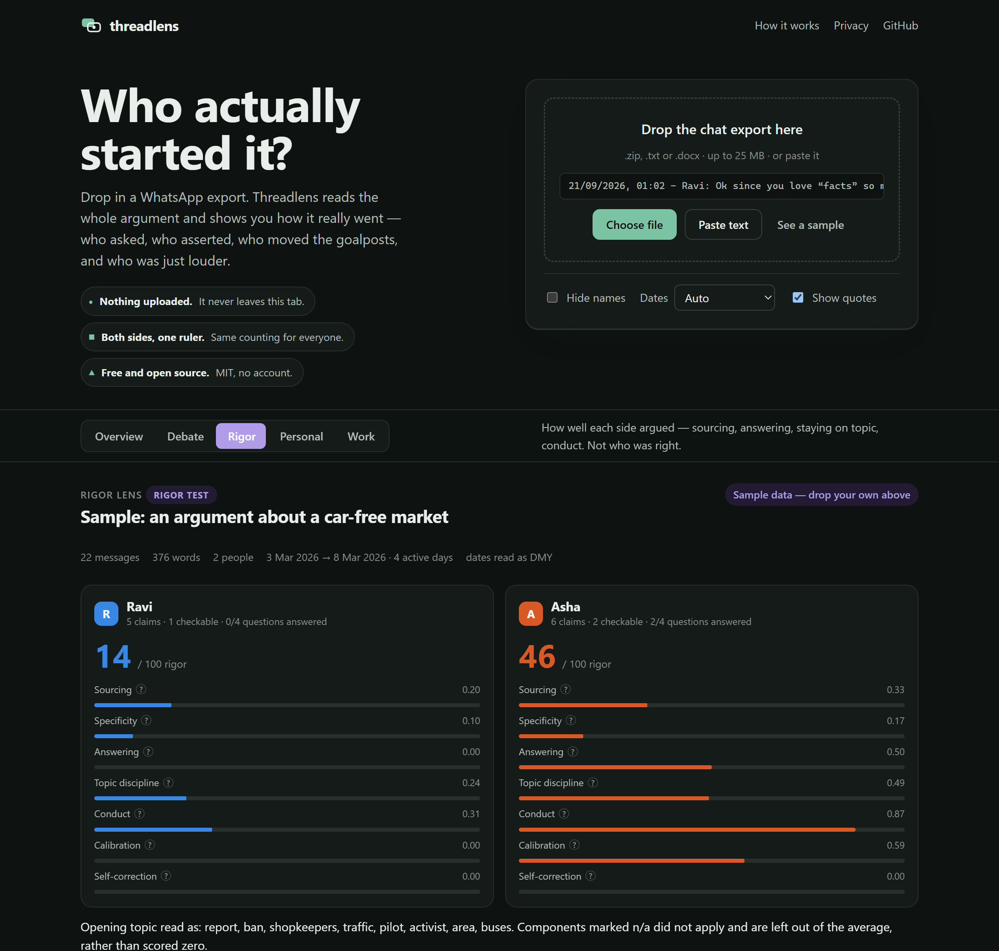

# Threadlens

**Who actually started it?**

Threadlens reads a WhatsApp chat export and shows how the argument really went: who asked questions and who
just asserted, who moved the goalposts, where the heat rose, and how well each side actually argued. It runs
**entirely in your browser** — the chat is never uploaded, and the page is built so that it *cannot* be.

**Live app:** https://kaustav1311.github.io/threadlens/


<details>
<summary>Dark theme</summary>



</details>

## Who it's for

Anyone trying to see a conversation clearly from inside it:

- **Relationship arguments over text** — who reaches out, who replies, when the warmth dropped off, whether
  either of you has asked the other a question lately.
- **Family and friend group chats** — who dominates, who gets talked over, how the tone drifts.
- **Political arguments with someone you like** — the Rigor lens scores *how* each side argued without ever
  taking a side.
- **Work threads** — responsiveness, clarity, after-hours load.

It is a **mirror, not a verdict**. It cannot tell you who was right, whether your relationship is in trouble,
or anything about anyone's personality or mental health. Anything claiming otherwise is selling something.

## Why

Arguments over chat are hard to see clearly from inside them. Threadlens applies the **same counting rules to
everyone** and shows its working, so the numbers read as a mirror rather than a weapon.

## Features

- **Drop a file:** a `.zip` or `.txt` straight from *WhatsApp → Export chat*, a `.docx` copy, or pasted text.
  It handles Android and iPhone formats, 12- and 24-hour clocks, and DD/MM, MM/DD or YYYY/MM dates
  (auto-detected, with a manual override).
- **Five lenses:**
  - **Overview:** the basics — who talks, when, how much.
  - **Debate:** questions vs. assertions, absolutist words, evidence words, group labels, put-downs, heat
    trend, moral vocabulary and rhetorical cues.
  - **Rigor:** a 0–100 score for *how well each person argued*. See below.
  - **Personal:** who starts conversations, reply times, affection, apologies and tone.
  - **Work:** responsiveness, action and urgency words, politeness and after-hours load.
- **Plain-language findings** that always name both sides and the size of the gap. Comparisons switch off when
  a person wrote fewer than 150 words.
- **Charts with hover and a table view,** light and dark themes, a phone layout, and every animation disabled
  under `prefers-reduced-motion`.
- **Anonymise** names to Person A, B… before you share anything.
- **Export** the report as Markdown or JSON.

## The Rigor lens

A score out of 100 for the *conduct* of an argument, never its conclusions. Seven weighted components, each of
which opens to show exactly how it was computed:

| Component | What it counts | Weight |
|---|---|---|
| Sourcing | share of factual claims pointing at something checkable: a link, a named report/court/section, a date or a statistic | 25 |
| Answering | share of the other person's direct questions actually engaged with in the next 6 messages | 20 |
| Topic discipline | how close messages stay to the opening topic, minus a penalty for swerving right after being challenged | 15 |
| Conduct | falls with personal attacks, group labels, status put-downs and profanity per 100 words | 15 |
| Specificity | numbers, dates and proper nouns per claim | 10 |
| Calibration | hedging and granting a point raise it; absolutist words lower it | 10 |
| Self-correction | explicitly correcting your own earlier claim | 5 |

It also produces a **claim ledger** (every factual-sounding sentence, and whether it cited anything), a list of
**questions nobody answered**, and a **drift timeline**. Threadlens never marks a claim true or false — export
the ledger with `--ledger claims.json` and check them yourself, or hand them to an LLM that can.

### How it stays neutral

Neutrality here is enforced by tests, not by good intentions:

- **No party, leader or policy name** appears in any scoring list. A test walks every list and fails the build
  if one does.
- **`political_label` is balanced.** Labels are tagged by *who typically uses* them rather than who they
  target — because that is what decides which side the metric flags more often — and the left-coded and
  right-coded lists must stay within 20% of each other in count. Currently 33 / 37, a 10.8% skew.
- **Mirrored samples.** [`samples/rigor_left_vs_right.txt`](samples/rigor_left_vs_right.txt) and its mirror are
  the same argument with the speakers, stances and slurs swapped. Both test suites assert the scores swap
  within 3 points. They currently swap exactly.

Listing a slur in `lexicons/lexicons.json` is detection, not endorsement.

## Privacy by design

| | |
|---|---|
| Processing | 100% client-side JavaScript. No server, no analytics, no cookies, no account. |
| Enforced | `dist/index.html` ships a Content-Security-Policy with `connect-src 'none'` and hashed scripts, so the page **cannot** make network requests. A test asserts it. |
| Offline | Download `dist/index.html` and open it with Wi-Fi off. It works identically. |
| Third parties | None. System fonts only; JSZip is vendored inline. |
| Memory | "Forget this chat" drops it; closing the tab does the same. |

Large exports are analysed in a Web Worker built from a Blob of the app's own code, which is the only reason
the CSP allows `worker-src blob:`. Nothing is fetched.

See [PRIVACY.md](PRIVACY.md) for details, including the ethics of analysing other people's messages.

## Limits

- **Web app:** files up to 25 MB and 250,000 messages. The page allows 8 analyses per 10 minutes, which keeps
  the tab responsive on large exports. There is no server, so there is nothing else to rate-limit.
- **Self-hosted API:** per-IP limits of 5 requests a minute and 100 a day, and uploads up to 10 MB. All configurable.

## What it measures (and doesn't)

| Measure | How |
|---|---|
| Questions vs. assertions | share of messages containing `?` |
| Absolutist words | always / never / every / nothing… ([Al-Mosaiwi & Johnstone, 2018](https://doi.org/10.1177/2167702617747074)) |
| Evidence, hedging, pronouns, politeness… | open word lists in [`lexicons/lexicons.json`](lexicons/lexicons.json), English + romanised Hindi |
| Tone | [VADER](https://github.com/cjhutto/vaderSentiment) lexicon (MIT) with simple negation |
| Heat | transparent 0–1 hostility heuristic: insults, profanity, group labels, put-downs, personal-attack phrases, shouting, damped by message length |
| Moral vocabulary | care, fairness, loyalty, authority and purity word lists after Moral Foundations Theory ([Graham, Haidt & Nosek, 2009](https://doi.org/10.1037/a0015141)) |
| Rhetorical cues | regex phrase patterns (whataboutism, false choice, exit then return, unfalsifiable certainty, personal attack), each linked to the matching messages |
| Rigor | the seven components above, all conduct, none ideological |
| Rhythm | conversation starts after a 6-hour gap, median reply time, after-hours share |

**It does not** measure personality, intelligence or mental health. It will misread sarcasm, quotations and
languages it doesn't know. Romanised Hindi and other code-mixed text are only partly covered, so tone and heat
undercount them. Treat every number as a reason to re-read the messages.

## Run it

```bash
# Web app (no dependencies)
node scripts/build.mjs          # -> dist/index.html (open it in a browser)
node --test "web/test/*.test.js"

# Python CLI (same scoring, adds optional local ML models)
pip install -e python                          # core, zero dependencies
threadlens analyse chat.zip --lens rigor --anon --md report.md
threadlens analyse chat.zip --lens rigor --ledger claims.json   # export claims to verify yourself

pip install -e "python[deep]"                  # Detoxify, fallacy classifier, NLI self-contradiction
threadlens analyse chat.zip --lens rigor --deep

# Self-hosted API with rate limits
pip install -e "python[server]" && threadlens serve       # http://127.0.0.1:8000/docs
docker build -t threadlens . && docker run -p 8000:8000 threadlens
```

Configure the API with environment variables:

| Variable | Default |
|---|---|
| `THREADLENS_RATE_PER_MIN` | 5 |
| `THREADLENS_RATE_PER_DAY` | 100 |
| `THREADLENS_MAX_UPLOAD_MB` | 10 |
| `THREADLENS_DEEP` | 0 |
| `THREADLENS_TRUST_PROXY` | 0 (set to 1 only behind your own reverse proxy) |

```bash
curl -F file=@chat.txt -F lens=rigor http://127.0.0.1:8000/v1/analyse
```

## Deploy your own

The whole app is one HTML file, so any static host works and none of them need a build step beyond
`node scripts/build.mjs`.

| Host | Free tier | Notes |
|---|---|---|
| **GitHub Pages** | 100 GB/month soft limit | What this repo uses. Push to `main` and the workflow does the rest. No analytics of any kind. |
| **Cloudflare Pages** | unlimited bandwidth, 500 builds/month | The most generous free tier. Point it at the repo with build command `node scripts/build.mjs` and output directory `dist`. |
| **Netlify** | 100 GB/month | Fine, but bandwidth overages are expensive and its analytics are paid. |
| **Anywhere else** | — | Upload `dist/index.html`. Or just open the file — it needs no host at all. |

There is deliberately **no visitor counter**: any beacon would break the `connect-src 'none'` guarantee and make
the privacy claim on the page false. If you want numbers for your own fork, GitHub's *Insights → Traffic* tab is
free and needs no code in the page, or serve it behind a CDN that reports from its own edge logs.

## Project layout

```
web/src/core.js      parsing + scoring + rigor (browser and Node, no dependencies)
web/src/app.js       UI
web/src/body.html    markup · web/src/style.css  styles
lexicons/            shared word lists (JSON), used by web and Python
python/threadlens/   parser, metrics, rigor, report, deep models, CLI, FastAPI server
scripts/build.mjs    builds single-file dist/index.html with a hashed-script CSP
scripts/rigor-dump.mjs  emits the JS rigor result so pytest can diff it against Python
samples/             synthetic example chats (never commit real chats)
```

## Contributing

Better word lists are the highest-value contribution, especially for Bengali, Tamil, Urdu and other languages —
and keeping `political_label` balanced as it grows. See [CONTRIBUTING.md](CONTRIBUTING.md). Please **never**
attach real chats to issues or PRs. Use synthetic examples.

## License

MIT. The VADER lexicon is MIT (C.J. Hutto). JSZip is MIT/GPLv3 dual-licensed and used under MIT.
